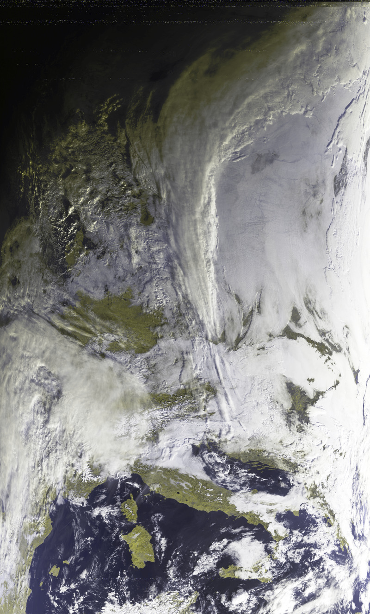
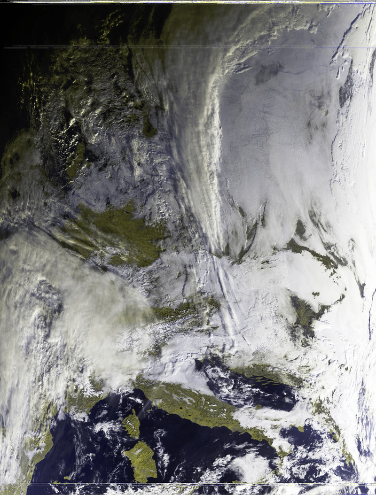
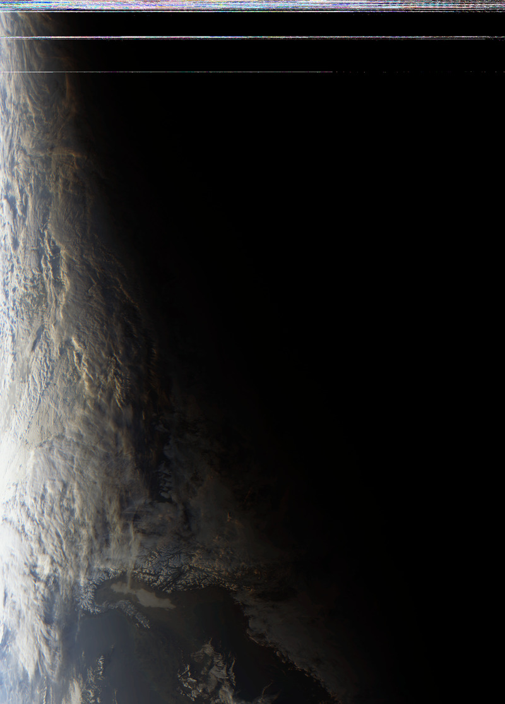
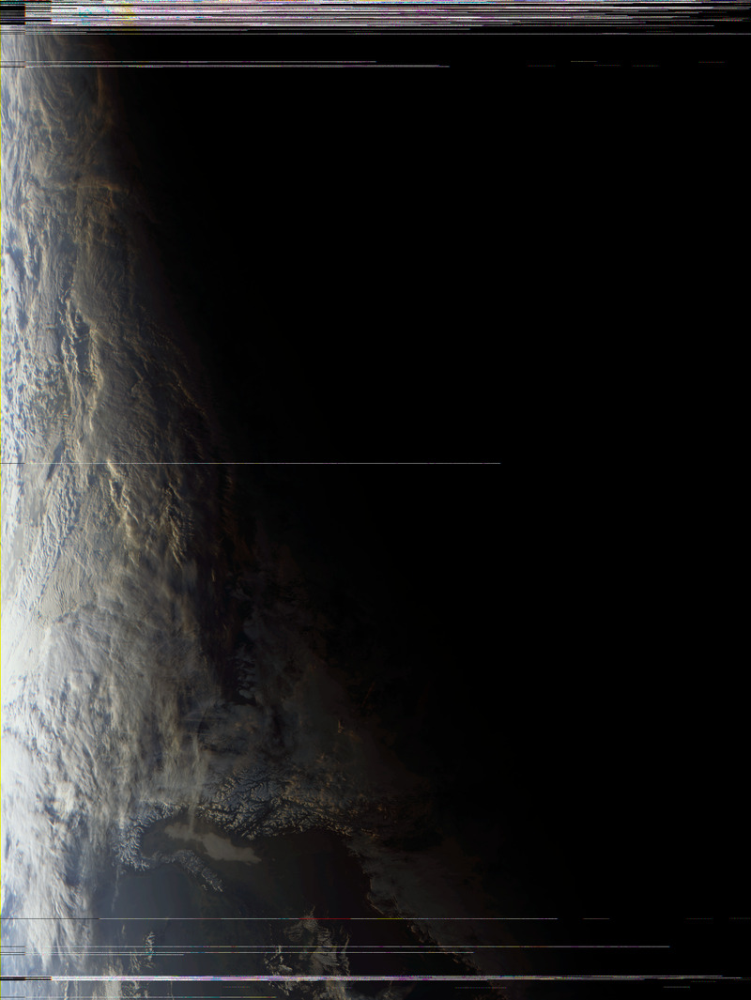
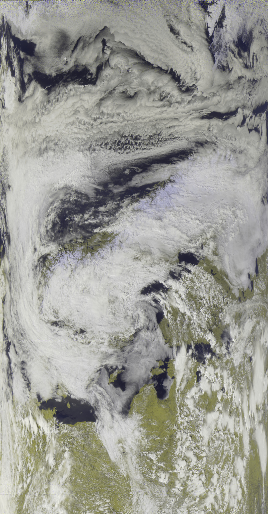
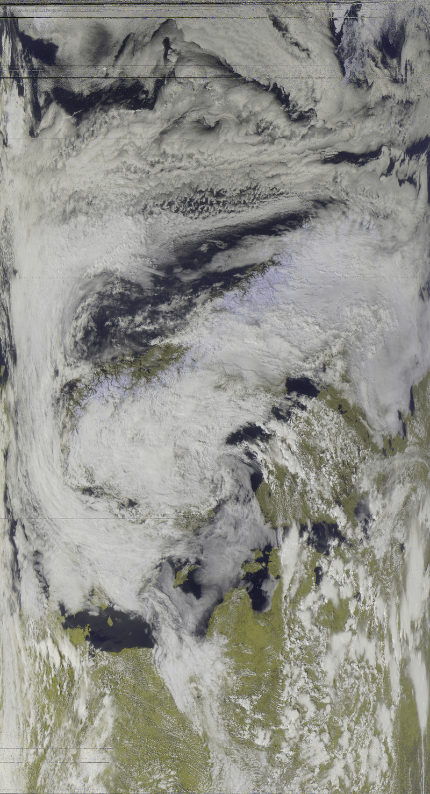
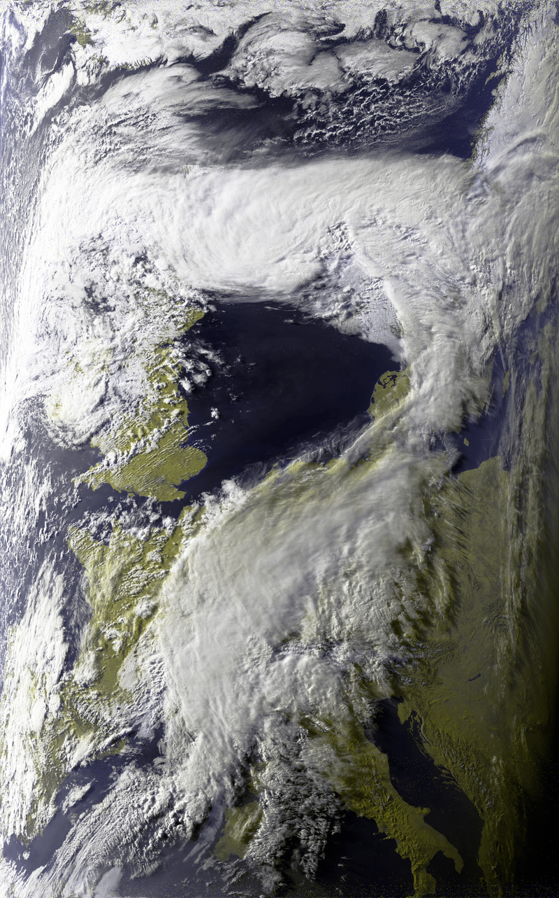
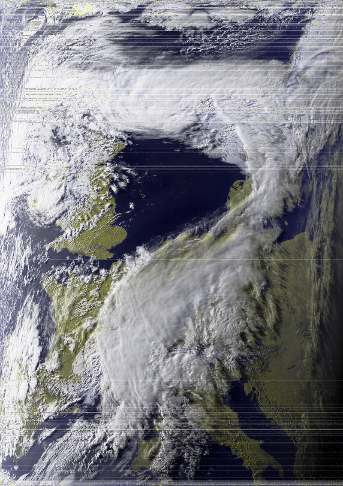

# LeanHRPT Decode

[](https://github.com/Xerbo/LeanHRPT-Decode/actions/workflows/build.yml)

A high quality, easy to use HRPT decoder.

## Usage

See the [wiki](https://github.com/Xerbo/LeanHRPT-Decode/wiki).

## Installation

Compiled builds for Linux and Windows are available from the [releases](https://github.com/Xerbo/LeanHRPT-Decode/releases) page.

## Building from source

For those who wish to compile from source you will need `qtbase5-dev`, [`libcorrect`](https://github.com/quiet/libcorrect), [`muparser`](https://github.com/beltoforion/muparser) and [`libpredict`](https://github.com/la1k/libpredict) installed. After that you can compile with:

```sh
mkdir build && cd build
cmake ..
make
```

You may also wish to symlink the configuration files into the build directory:

```sh
# Assuming you are in LeanHRPT-Decode/build
ln -s ../presets.ini ..
ln -s ../calibration.ini ..
ln -s ../projection.ini ..
```

And then run the resulting binary.

### Packaging your own builds

TODO

## Example results

|Satellite|LeanHRPT|SatDump|
 -|-|-
|MetOp<br/>(Airspy Mini and SAWBird GOES+, received by Byggemandboesen)|||
|FengYun<br/>(Airspy Mini and SAWBird GOES+, received by Byggemandboesen)|||
|Meteor<br/>(NooElec NESDR SMArt @ 2.4msps and SAWBird GOES+, received by me)|||
|NOAA<br/>(NooElec NESDR SMArt @ 2.4msps and SAWBird GOES+, received by me)|||

## Input file format

Input files should be:

 - NOAA - raw data, bi-phase/manchester/PM decoded and not raw16
 - Meteor - raw data, bi-phase/manchester/PM decoded or CADUs (deframed)
 - MetOp - output from viterbi, CADUs (deframed, derandomized with RS applied) or VCDUs
 - FengYun - output from viterbi, CADUs (deframed, derandomized with RS applied) or VCDUs

## Credits

 - Reed Solomon - adapted from `libsathelper`
 - Geotranslation code - taken from `MeteorDemod`
